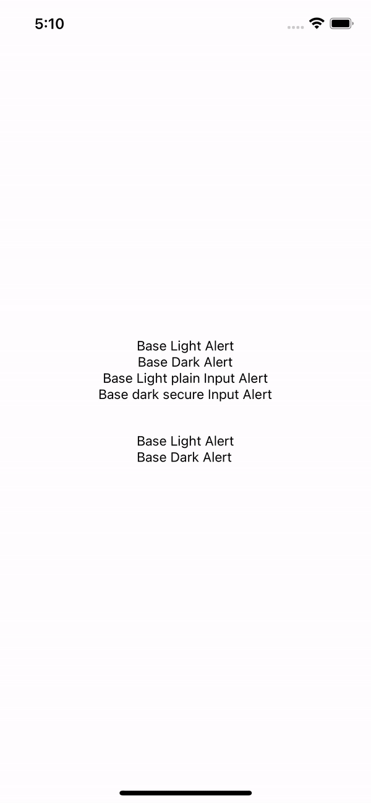
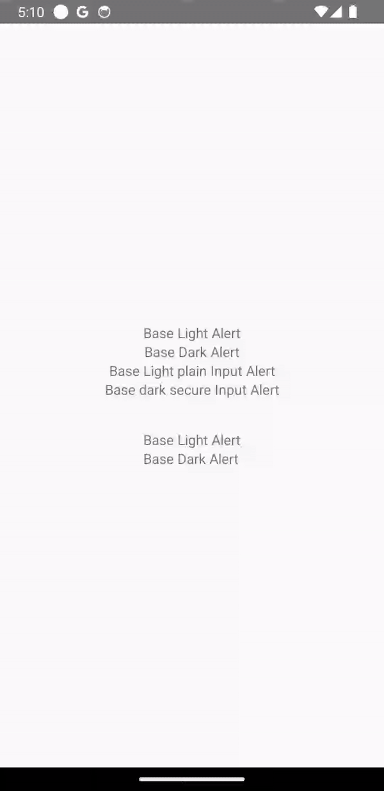

# react-native-alerts

Native Alerts for RN

## Installation

```sh
"react-native-alerts": "sergeymild/react-native-alerts#1.1.1"
```

|   |   |
|---|---|

## Usage

```js
import { alert } from 'react-native-alerts';

// present alert
const id = await alert.alert({
    // light | dark
    theme: 'dark',
    title: 'Title',
    message: 'Message',
    buttons: [
        { 
            text: 'Default',
            // default | destructive | cancel 
            style: 'default', 
            // can be any string
            id: 'base' 
        },
        { 
            text: 'Remove', 
            // default | destructive | cancel
            style: 'destructive',
            // can be any string 
            id: 'remove' 
        },
        { 
            text: 'Cancel',
            // default | destructive | cancel 
            style: 'cancel', 
            // can be any string
            id: 'cancel' 
        },
    ],
});
          
// present alert wiith input
const data = await alert.prompt({
    // light | dark
    theme: 'light',
    title: 'Title',
    message: 'Message',
    // default prompt imput value
    defaultValue: 'some',
    // 'default' | 'plain-text' | 'secure-text'
    type: 'plain-text',
    buttons: [
        { 
            text: 'Default',
            // default | destructive | cancel 
            style: 'default', 
            // can be any string
            id: 'base' 
        },
        { 
            text: 'Remove', 
            // default | destructive | cancel
            style: 'destructive',
            // can be any string 
            id: 'remove' 
        },
        { 
            text: 'Cancel',
            // default | destructive | cancel 
            style: 'cancel', 
            // can be any string
            id: 'cancel' 
        },
    ],
});
const {id, value} = data

// present bottom sheet alert

// android only
// can be passed in title, message or buttons
type Appearance = {
  textAlign?: 'center' | 'left';
  fontSize?: number;
  color?: string;
  fontFamily?: string;
};

const id = await sheetAlert.show({
    // ios only pass text's tint color
    iosTintColor: color
    // light | dark
    theme: 'light',
    message: {
        text: 'Some awesome message will be here',
        // android only
        appearance: Appearance,
    },
    title: {
        text: 'Some awesome title',
        // android only
        appearance: Appearance,
},
buttons: [
  {
    text: 'Edit',
    // can be any string 
    id: 'someId',
    // default | destructive | cancel
    style: 'default',
    // --- on Android icon might be either in assets or drawable
    // if icon in assets just pass asset:/icon_name.png
    // if icon in drawable just pass icon_name.png
    // or pass require('src/assets/icon.png')

    // --- on Android icon might be either in assets or drawable
    // if icon in assets just pass icon_name.png
    // if icon in drawable (bundle, Images.xcassets) just pass icon_name.png
    // or pass require('src/assets/icon.png')
    icon?: {type: 'asset' | 'drawable' | 'require', icon: string | ImageRequireSource}
    // android only
    appearance: Appearance,
  },
  {
    text: 'Delete',
    // can be any string 
    id: 'someId',
    // default | destructive | cancel
    style: 'destructive',
    // android only
    appearance: Appearance,
  },
  {
    text: 'Cancel',
    // can be any string 
    id: 'someId',
    // default | destructive | cancel
    style: 'cancel',
    // android only
    appearance: Appearance,
  },
],
});
```

## Contributing

See the [contributing guide](CONTRIBUTING.md) to learn how to contribute to the repository and the development workflow.

## License

MIT

---

Made with [create-react-native-library](https://github.com/callstack/react-native-builder-bob)
